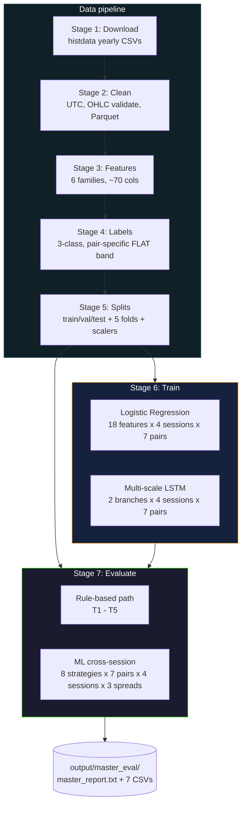
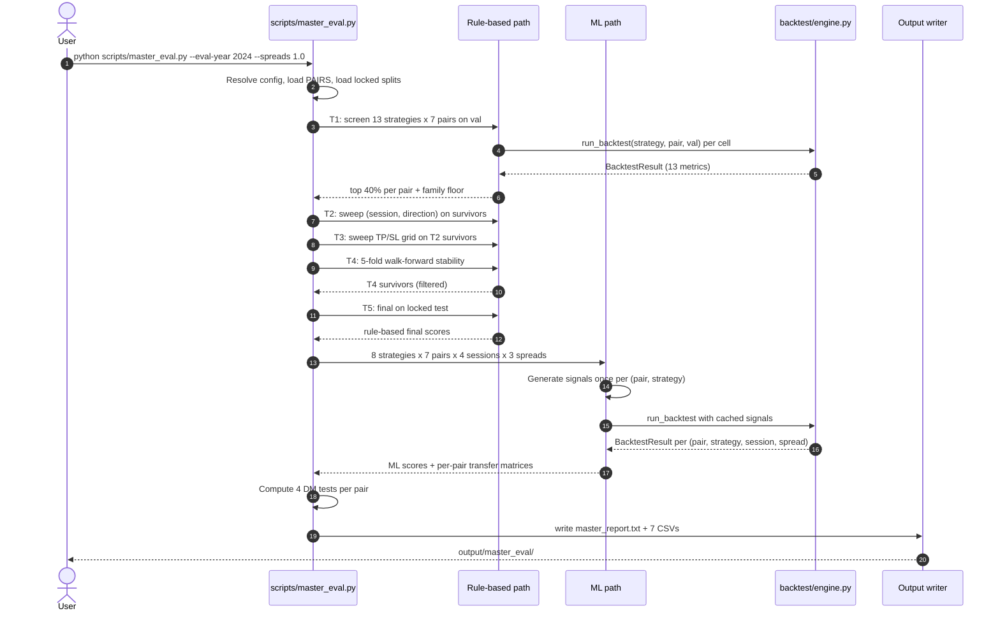
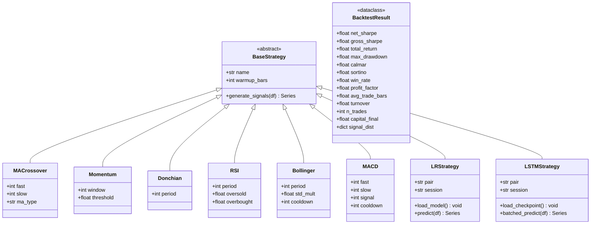
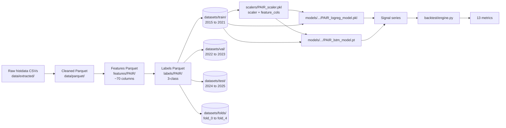
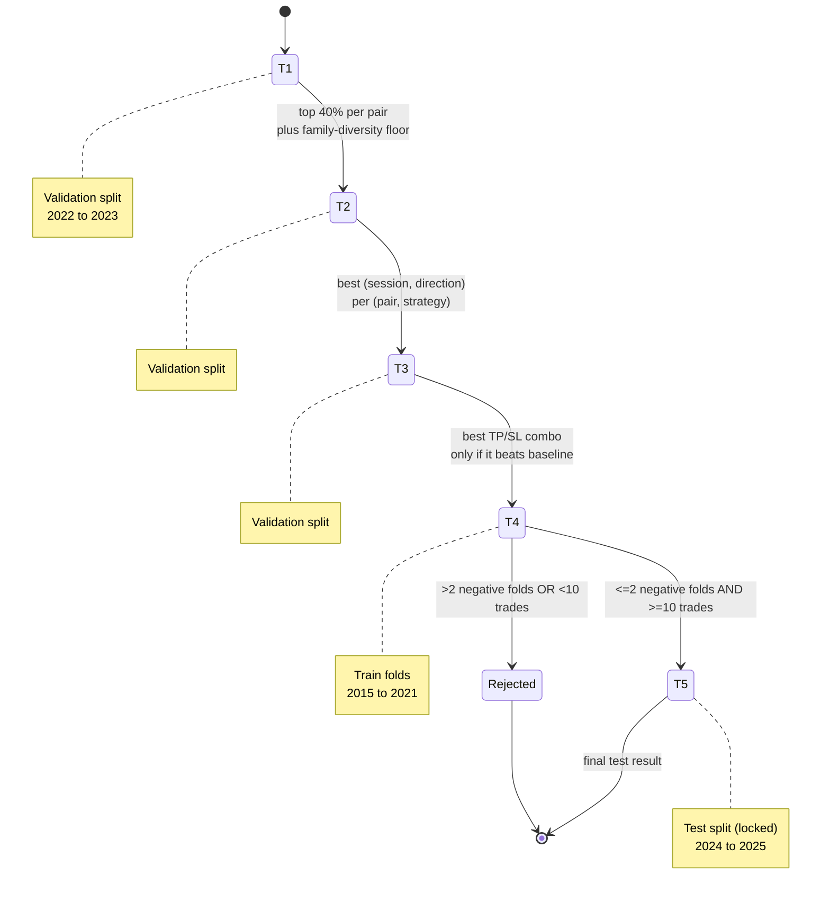
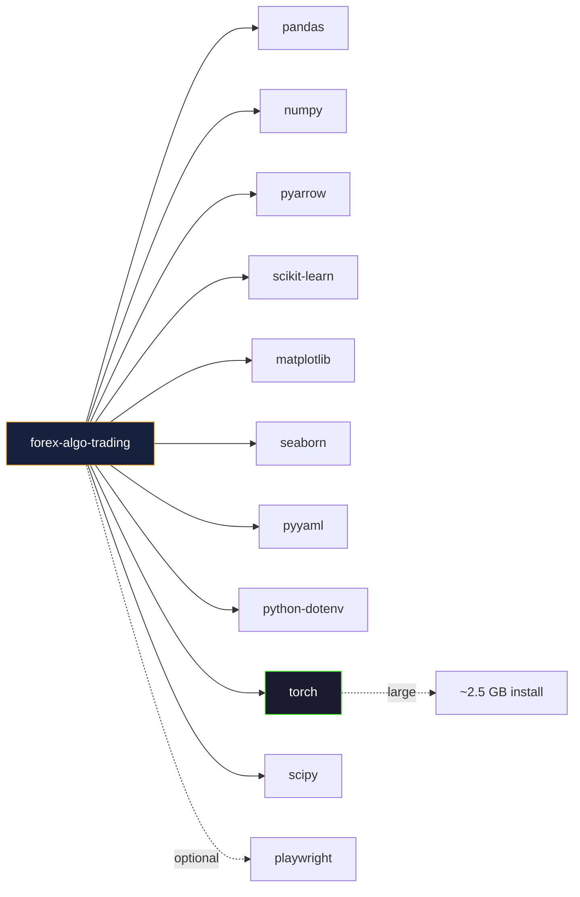

# Architecture

This document is the long-form architecture reference for forex-algo-trading. It contains six diagrams covering the system shape, the master-evaluation flow, the strategy class hierarchy, the data flow, the evaluation tier state machine, and the dependency graph. After the diagrams come the architecture decision records and the source-map table.

The lightweight summary lives in the project README. This file is the place to look when investigating a specific component, planning a refactor, or reviewing why a particular design choice was made.

---

## High-level system flowchart

Each pipeline stage writes to a fixed location with a fixed schema, and each stage is its own script. The isolation is deliberate: when a single stage fails, the offending stage can be re-run without invalidating downstream state. The stages also have stable boundaries that the test suite exercises directly. A regression in stage three is caught before it can corrupt stage four.

---

## Master evaluation sequence

The master evaluation orchestrates the rule-based and ML paths in a single pass. The following sequence diagram shows the order of operations for a typical invocation.

The signal-cache decision (step 13) saves substantial runtime. The ML signal series for a given (pair, ml_strategy) does not change with the evaluation session or the spread, only the cost-and-mask bookkeeping changes. Caching the signal once and reusing it across the twelve session-by-spread combinations turns a four-hour ML evaluation into a fifteen-minute one.

---

## Strategy class hierarchy

The strategy module exposes a single abstract base class with concrete subclasses for each rule-based family and adapter classes for the learned models. The backtest engine consumes strategies through the base interface only.

Every strategy returns a signal series with the same index as the input price series and values in the set `{-1, 0, +1}` representing DOWN, FLAT, UP. The engine handles position management, cost application, and metric computation. Strategies do not see prices; they see features and emit signals.

The `BacktestResult` dataclass is the engine's only return type. Its thirteen fields are the canonical metric set used by every tier of the master evaluation and by the standalone `run_backtest.py` CLI.

---

## Data flow

The split direction is one-way: features and labels are computed on the full per-pair series, then sliced into train, validation, test, and folds on row indices, never on time-aware joins. This guarantees that feature definitions are identical across splits and that no leakage exists at the join layer.

The scaler contract is small but load-bearing. Each `scalers/{PAIR}_scaler.pkl` is a dict with two keys, `scaler` (a fitted `StandardScaler`) and `feature_cols` (the list of column names the scaler was fit against, in order). Every consumer of the scaler reads both. A silent column reordering between training and inference would otherwise produce systematically wrong predictions.

---

## Evaluation tier state machine

The tier progression encodes the project's selection-versus-evaluation discipline. T1, T2, and T3 are tuning tiers and run only on the validation split. T4 is a stability check on the training folds. T5 is the only tier that touches the locked test split, and it touches the test split exactly once per evaluation cycle. There is no T6 and no further tuning beyond T5. Whatever T5 reports for a (pair, strategy) cell is the answer.

---

## Dependency graph

Ten direct production dependencies plus one optional dependency (`playwright`, used only by the optional PDF export of HTML backtest reports). Transitive dependencies are not shown; the lockfile-equivalent listing is `requirements.txt` (currently unpinned, on the project TODO list).

The torch dependency dominates the install size. The LSTM is the only consumer; if the LSTM layer is disabled in a future fork, removing torch reduces the install footprint substantially. The current platform retains torch unconditionally because the LSTM is in the research scope.

---

## Architecture decision records

| Decision | Rationale | Alternatives considered | Why not the alternatives |
|----------|-----------|-------------------------|--------------------------|
| Tiered evaluation T1 to T5 | A single-pass screen produced uninterpretable results that drowned the signal in noise. The tiered structure separates concerns: screen, narrow, tune, stabilise, evaluate. | Single grand-search over all dimensions | The cross-product of strategy x session x direction x TP/SL x fold is too large to navigate without intermediate filters. |
| Flat per-pair pip spread | A flat spread is identical for every strategy in the system, which makes the comparison harder to abuse. The cost is the same for every strategy; differences are due to strategy behaviour, not modelling choices. | Stochastic spread with slippage and partial-fill simulation | More parameters introduce more degrees of freedom for the comparison to be subtly skewed by modelling choices rather than by strategy differences. |
| Locked split dates as constants | Comparability across runs requires that every strategy sees the same calendar windows. Hard-coded constants prevent silent slides during ablations. | Configurable splits via CLI | Any slide invalidates the comparability that the rest of the platform is built around. |
| 3-class label with pair-specific FLAT band | Sign-of-return labels caused class imbalance and pushed every model toward degenerate "always UP" or "always FLAT" solutions. The FLAT band is calibrated per-pair on the training distribution. | Sign-of-return; meta-labelling; triple-barrier | Sign-of-return collapses; meta-labelling and triple-barrier add complexity without solving the comparability question. |
| Two-branch LSTM | Minute-level FX has structure at multiple time scales. A single-branch model with one window length either underweights the long-horizon volatility regime or ignores short-horizon momentum. | Single-branch with 60-bar window; single-branch with 15-bar window | Each fails one of the two horizons. The two-branch architecture is, by construction, a compromise between those failure modes. |
| Session injection at the merge point | The session changes slowly relative to the per-bar features. Injecting the session at every time step is mostly redundant; injecting it as a dense conditioning vector on the merged recurrent representation is closer to the intent. | Inject session at every time step; learnable session embedding instead of one-hot | Per-step injection is wasteful; a learnable embedding adds parameters without a research justification. |
| Exclude XGBoost and LightGBM | Research scope. The framing of RQ2 is LR versus LSTM; a third learned model would dilute the answer rather than sharpen it. | Add boosted trees as a third class | Distracts from the pairwise framing. The question "does LSTM beat boosted trees" is interesting but is not the project's question. |
| 35 / 25 / 25 / 15 composite weights | Net Sharpe is the canonical risk-adjusted return metric and earns the largest weight. Sortino and Calmar add downside-and-drawdown information. Drawdown safety is implicit in Calmar plus the gates and earns the smallest weight. | Equal weights; Sharpe-only; expected utility | Equal weights underweight the most informative metric. Sharpe-only ignores drawdown information. Expected utility is opinionated about risk preferences. |
| Hard gates on n_trades < 10 and max_dd < -0.95 | Below those thresholds the strategy is either statistically meaningless or economically catastrophic. A fluke high Sharpe on three lucky trades should not appear at the top of the leaderboard. | Soft penalties via gradient | Soft penalties allow lottery-ticket strategies to ride to the top with enough other-metric strength. Hard gates are unambiguous. |
| Diebold-Mariano with Newey-West HAC | Consecutive bars are not independent. The naive variance estimator would be much too small and the test statistic would be inflated. | Naive DM; bootstrap | Naive DM is wrong here. Bootstrap is defensible but more expensive and gives a less canonical result. |

---

## Source map

| Folder | Purpose |
|--------|---------|
| `backtest/` | Backtest engine (`engine.py` with `run_backtest` and `BacktestResult`), strategy implementations (`strategies.py`), per-strategy CLI (`run_backtest.py`), HTML report generator (`report_generator.py`), Jinja templates (`templates/`), generated reports (`reports/`). |
| `scripts/` | Seven pipeline stage scripts (`download`, `clean`, `features`, `labels`, `split`, `train_model`, `master_eval`), the multi-cell training driver (`train_all.py`), exploratory data analysis scripts, the optional PDF exporter, and shared helpers (`_common.py`). |
| `config/` | Frozen runtime constants (`constants.py`: locked split dates, frozen feature lists, env-overridable runtime values, per-pair pip spreads), root logger setup (`logging_setup.py`). |
| `tests/` | Pytest test suite, twelve files. Coverage spans the engine loop, walk-forward fold paths, metric definitions, ML feature plumbing, ML strategy adapter behaviour, pair centralisation, position management, session masks, and walk-forward boundary handling. |
| `output/master_eval/` | Master evaluation artefacts. `master_report.txt` is the definitive text report. The seven CSVs (`results_all.csv`, `results_ml.csv`, `results_rule_based.csv`, `best_worst_per_pair.csv`, `dm_test_results.csv`, `session_generalisability.csv`, plus per-pair transfer matrices) are the structured outputs. |
| `models/global/` | Trained global-condition checkpoints. One pickle per pair for LR (`{PAIR}_logreg_model.pkl`), one PyTorch checkpoint per pair for LSTM (`{PAIR}_lstm_model.pt`). |
| `models/session/` | Trained session-conditional checkpoints. `london/`, `ny/`, and `asia/` subdirectories each contain per-pair LR pickles and per-pair LSTM checkpoints, where trained. |
| `scalers/` | One pickle per pair containing a fitted `StandardScaler` and the list of feature column names it was fit against. |
| `data/` | Raw extracted CSVs and cleaned per-pair Parquets. Gitignored, around 2.6 GB on disk. Regenerable from stages 1 and 2. |
| `features/` | Per-pair feature Parquets (one Parquet per pair, around seventy columns each). Gitignored, around 6.5 GB on disk. Regenerable from stage 3. |
| `labels/` | Per-pair label Parquets. Gitignored, around 6.9 GB on disk. Regenerable from stage 4. |
| `datasets/` | Train, validation, test, and walk-forward fold slices per pair. Gitignored, around 30 GB on disk. Regenerable from stage 5. |
| `docs/` | Documentation: setup, experiments, findings (placeholder). |
| `eda/` | Exploratory data analysis outputs (e.g. `split_readiness/split_readiness.csv`). |

---

## Implementation notes

A handful of implementation details are worth flagging here because they have non-obvious correctness implications.

**Label remap for the LSTM.** PyTorch's `CrossEntropyLoss` requires non-negative integer class indices. The platform's raw labels use `{-1, 0, +1}` because that mapping makes the backtest engine's signal arithmetic clean (position times signed signal yields the right sign convention). At LSTM training time the labels are remapped: `-1 -> 0`, `0 -> 1`, `+1 -> 2`. At inference time the inverse is applied: `argmax==0 -> -1`, `argmax==1 -> 0`, `argmax==2 -> +1`. The remap appears in two places in the codebase, and a regression test asserts that the round-trip is correct.

**Batched LSTM inference.** The first version of LSTM inference iterated bar-by-bar, building a fresh `(15, 5)` short-window tensor and a fresh `(60, 4)` long-window tensor for each test bar. The result was correct and roughly two orders of magnitude too slow for the cross-session evaluation grid. The current version builds all sliding-window arrays up front using NumPy stride tricks, then forwards through the model in chunks of 4096 samples at a time. Throughput is around 31,000 bars per second on a CPU.

**Scaler contract.** Every consumer of a scaler reads both the `scaler` and the `feature_cols` keys. The features tensor at inference is assembled in the order specified by `feature_cols`, not by the natural column order of whatever DataFrame was passed in. This protects against silent column reorderings between training and inference. A regression test asserts that the contract is honoured.

**Fold parquet paths.** Walk-forward folds resolve to `datasets/folds/fold_N/` Parquet files, not to slices of the training Parquet by row index. Earlier versions of the code used row-index slicing as a fallback. The fallback was removed because it produced subtly different results than the canonical Parquet form and made fold-level reproducibility harder to audit.

**Determinism in master_eval.** The master evaluation script is deterministic given a fixed configuration: same pair set, same evaluation window, same spread multipliers, same model checkpoints on disk. Back-to-back runs produce diff-equal outputs. This is a precondition for RQ0 and the test suite covers it indirectly through the per-stage regression tests.
