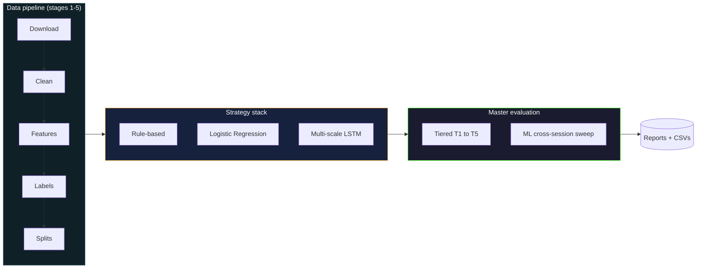
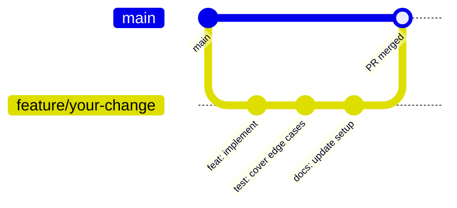

<p align="center">
  
  
  
  
  
</p>

A reproducible research platform for minute-level FX strategy evaluation across seven currency pairs.

FX backtest results in published research are rarely comparable across studies. Bar resolutions, cost assumptions, validation windows, and evaluation metrics drift from paper to paper, which makes head-to-head ranking of strategies unreliable. This project is the apparatus that fixes the comparability problem: every strategy in the system, whether rule-based, classical machine learning, or deep, runs against identical bars, identical costs, identical splits, and is scored by an identical composite metric. The result is a tiered evaluation that produces a single comparable number per strategy on a fixed 2024 to 2025 test window.

[Quick start](#quick-start) · [Architecture](#architecture) · [Findings](docs/FINDINGS.md) · [Setup](docs/SETUP.md) · [Contributing](#contributing)

---

## The problem

Strategy comparison in FX research suffers from an apparatus problem. Studies report Sharpe ratios on different bar frequencies, evaluate against costs that range from zero to elaborate stochastic spread models, train and test on overlapping or unstated windows, and pick the metric that flatters their result. The literature accumulates strategy claims that cannot be ranked against each other.

Forex-algo-trading is the apparatus, not the strategy. The deliverables are the platform and the answers to a small set of well-defined research questions. The platform was built so that any strategy added to the system inherits the data, the costs, the splits, and the scoring of every other strategy. Two researchers can disagree about which strategy is better; they cannot disagree about whether the comparison was fair.

The platform handles seven major currency pairs (EURUSD, GBPUSD, USDJPY, USDCHF, USDCAD, AUDUSD, NZDUSD) at one-minute resolution from January 2015 through the end of 2025. Source bars come from histdata.com. The seven-stage pipeline turns raw downloads into labelled, scaled, split datasets ready for training and evaluation, and the master evaluation script produces a definitive set of CSVs and a text report that answer the research questions in one pass.

## Key objectives

1. **Reproducibility (RQ0).** Identical seeds, identical splits, and unmodified code must produce identical evaluation outputs on every run. Reproducibility is a precondition for the other questions, not an afterthought.
2. **Session conditioning (RQ1).** Determine whether models trained per trading session (Asia, London, New York) beat a single global model on cost-adjusted Sharpe. The hypothesis is that intraday FX regimes differ enough across sessions that pooling discards usable signal.
3. **Model complexity (RQ2).** Determine whether a multi-scale LSTM with explicit short-horizon and long-horizon branches outperforms a calibrated Logistic Regression under identical evaluation conditions. The framing is deliberate: cost-adjusted Sharpe is the metric, not classification AUC.
4. **A working multi-pair, multi-strategy evaluation pipeline.** The platform itself is a deliverable. Any researcher with the repository, a Python environment, and the patience to run the data pipeline should be able to reproduce the headline results bit-for-bit.

## Scope

| In scope | Out of scope |
|----------|--------------|
| 7 USD-major pairs (EURUSD, GBPUSD, USDJPY, USDCHF, USDCAD, AUDUSD, NZDUSD) | Cross-pair triangulation (EURGBP, EURJPY, etc.) |
| 1-minute bar data, 2015 to 2025 | Tick data; daily or higher resolutions |
| Rule-based stack (MA crossover, momentum, Donchian, RSI, Bollinger, MACD) | Custom or proprietary technical indicators |
| Logistic Regression (global + 3 session conditions) | Gradient-boosted trees (XGBoost, LightGBM) |
| Multi-scale LSTM (global + 3 session conditions) | Transformer models, attention variants |
| Walk-forward stability across 5 folds | Bayesian model averaging or stacking |
| Diebold-Mariano significance tests | Bootstrapped confidence intervals |
| Flat per-pair pip-spread cost model | Stochastic spread, slippage, or partial-fill modelling |
| Single-pair backtests | Portfolio-level optimisation across pairs |
| Locked validation and test windows | Rolling-window or expanding-window evaluation |

---

## Architecture

The system has three layers connected by a fixed data and evaluation flow.



The data pipeline is seven stages, executed in order: download, clean, features, labels, splits, train, evaluate. Stages 1 to 5 turn raw histdata CSVs into per-pair Parquets of around seventy feature columns and a three-class supervised label. Stage 6 trains models. Stage 7 evaluates.

The strategy stack is layered. Layer one contains the rule-based families. Layer two is Logistic Regression on a frozen 18-feature schema. Layer three is a two-branch LSTM that consumes a 15-bar short window and a 60-bar long window, merges them, and conditions the merged representation on a session one-hot vector before producing a three-class softmax over DOWN, FLAT, and UP.

The master evaluation runs in a single pass. The rule-based path is tiered: T1 screens, T2 sweeps session and direction, T3 sweeps a small TP/SL grid, T4 measures stability across five walk-forward folds, T5 produces the final test result. The ML path runs eight strategies across seven pairs, four evaluation sessions, and three spread multipliers, generating signals once per (pair, strategy) and reusing them across the twelve session-by-spread combinations.

Full architecture details, including six diagrams, the architecture decision records, and the source map, live in [`ARCHITECTURE.md`](ARCHITECTURE.md).

---

## Quick start

```bash
git clone https://github.com/Kanyal-HarsH/forex-algo-trading.git
cd forex-algo-trading
python -m venv venv
source venv/bin/activate            # macOS / Linux
# venv\Scripts\activate              # Windows
pip install -r requirements.txt
python -m pytest tests/ -q
```

Run a single rule-based backtest:

```bash
python backtest/run_backtest.py \
  --pair EURUSD \
  --strategy RSI_p14_os30_ob70 \
  --split test \
  --from 2024-01-02 --to 2024-01-02 \
  --capital 10000 --spread 0.6 --no-browser
```

Run the master evaluation on 2024:

```bash
python scripts/master_eval.py --eval-year 2024 --spreads 1.0
```

Full setup, all CLI flags, and the step-by-step walkthrough are in [`docs/SETUP.md`](docs/SETUP.md).

---

## Features

| Feature | Description | Status |
|---------|-------------|--------|
| Rule-based stack | Six families, thirteen named strategies (MA crossover, momentum, Donchian, RSI, Bollinger, MACD) | Stable |
| Logistic Regression | Eighteen-feature linear baseline, global + three session conditions | 28 of 28 cells trained |
| Multi-scale LSTM | Two-branch architecture with session injection, three-class softmax | 18 of 28 cells trained |
| Master evaluation | Tiered rule-based path (T1-T5) + ML cross-session sweep | Stable |
| Diebold-Mariano tests | Four DM comparisons per pair (RB-vs-BAH, ML-vs-BAH, in-domain-vs-transfer, champion-vs-runner-up) | Stable |
| Walk-forward stability | Five contiguous in-sample folds, mean-minus-half-std stability score | Stable |
| Composite scoring | 35% net Sharpe + 25% Sortino + 25% Calmar + 15% drawdown safety, hard gates | Stable |
| HTML backtest reports | Per-run HTML report with equity curve, drawdown, trade ledger, optional PDF export | Stable |
| Test suite | Pytest, twelve test files covering engine, walk-forward, sessions, ML features | Stable |

## Supported configurations

| Dimension | Values |
|-----------|--------|
| Currency pairs | EURUSD, GBPUSD, USDJPY, USDCHF, USDCAD, AUDUSD, NZDUSD |
| Bar resolution | 1 minute |
| Date range | 2015-01-01 to 2025-12-31 |
| Train window | 2015-01-01 to 2021-12-31 (locked) |
| Validation window | 2022-01-01 to 2023-12-31 (locked) |
| Test window | 2024-01-01 to 2025-12-31 (locked) |
| Walk-forward folds | 5 contiguous, non-overlapping |
| Session conditions | global, london, ny, asia |
| Per-pair flat spreads (pips) | EURUSD 0.6, GBPUSD 0.8, USDJPY 0.7, USDCHF 1.0, AUDUSD 0.8, USDCAD 1.0, NZDUSD 1.4 |
| Spread multipliers (evaluation) | 1.0, 1.5, 2.0 |
| Composite weights | 35 / 25 / 25 / 15 (Sharpe / Sortino / Calmar / DD-safety) |

---

## Project structure

```
forex-algo-trading/
│
├── 📂 backtest/                  # Backtest engine, strategies, CLI, HTML reports
│   ├── engine.py                 # run_backtest, BacktestResult (13 metrics)
│   ├── strategies.py             # Rule-based + ML strategy classes
│   ├── run_backtest.py           # Per-strategy CLI
│   ├── report_generator.py       # HTML report builder
│   ├── reports/                  # Generated HTML reports
│   └── templates/                # Jinja templates for report output
│
├── 📂 scripts/                   # Pipeline stage scripts
│   ├── download_fx_data.py       # Stage 1: pull yearly CSVs from histdata.com
│   ├── clean_fx_data.py          # Stage 2: validate, normalise, write Parquet
│   ├── features_fx_data.py       # Stage 3: compute six feature families
│   ├── labels_fx_data.py         # Stage 4: three-class forward-return labels
│   ├── split_fx_data.py          # Stage 5: train/val/test + folds + scalers
│   ├── train_model.py            # Stage 6: per-pair, per-session model training
│   ├── train_all.py              # Train every cell in the LR x LSTM grid
│   └── master_eval.py            # Stage 7: definitive evaluation
│
├── 📂 config/                    # Frozen runtime constants
│   ├── constants.py              # Locked splits, feature lists, env overrides
│   └── logging_setup.py          # Root logger configuration
│
├── 📂 tests/                     # Pytest suite (12 files)
├── 📂 output/master_eval/        # Master evaluation outputs (CSVs + report)
├── 📂 models/                    # Trained model checkpoints (global + session)
├── 📂 scalers/                   # Pickled StandardScaler + feature_cols list
│
├── 📂 data/                      # Raw + cleaned price data (gitignored, ~2.6 GB)
├── 📂 features/                  # Per-pair features (gitignored, ~6.5 GB)
├── 📂 labels/                    # Per-pair labels (gitignored, ~6.9 GB)
├── 📂 datasets/                  # Train/val/test/folds (gitignored, ~30 GB)
│
├── 📂 docs/                      # Setup, experiments, findings
├── 📂 eda/                       # Exploratory data analysis outputs
│
├── README.md                     # This file
├── ARCHITECTURE.md               # Full architecture documentation
├── requirements.txt              # Python dependencies
├── .env.example                  # Documented runtime overrides
└── .gitignore
```

The four large directories (`data/`, `features/`, `labels/`, `datasets/`) are gitignored. They are regenerable from the seven-stage pipeline; the bootstrap procedure is documented in [`docs/SETUP.md`](docs/SETUP.md).

---

## Contributing

The project is a two-person research effort, and the immediate priority is finishing the LSTM grid (ten cells outstanding) and producing the final evaluation pass. Contributions are welcome, particularly around test coverage, documentation, and reproducibility tooling.

### Development setup

```bash
pip install -r requirements.txt
python -m pytest tests/ -q
```

A linter is not configured by default. Ruff is recommended for ad-hoc linting:

```bash
pip install ruff
ruff check .
```

### Contribution workflow



The recent commit history follows conventional-commit style (every recent commit starts with `fix:`, `feat:`, `docs:`, etc.). New contributions should match.

### Conventional commits

| Type | When to use | Version bump |
|------|-------------|--------------|
| `feat` | New user-facing capability | Minor |
| `fix` | Bug fix that does not change behaviour intentionally | Patch |
| `feat!` or `BREAKING CHANGE` footer | Breaking interface change | Major |
| `docs` | Documentation-only change | None |
| `test` | Test-only change | None |
| `refactor` | Internal restructuring without behaviour change | None |
| `chore` | Build, deps, or repository-level housekeeping | None |

<details>
<summary>Code of conduct</summary>

A formal Code of Conduct has not yet been adopted. In the interim, contributors are expected to be respectful, constructive, and focused on the technical merits of the work. The project follows the spirit of the Contributor Covenant.

</details>

<details>
<summary>Security policy</summary>

Security disclosures should be reported privately to the repository maintainer rather than via public issues. A formal `SECURITY.md` is on the project TODO list.

</details>

<details>
<summary>Roadmap</summary>

Immediate next steps:

1. Train the ten outstanding LSTM cells (NZDUSD all four conditions, USDCAD all four conditions, AUDUSD ny and asia).
2. Run a full master evaluation across all seven pairs and the full 2024 to 2025 test window.
3. Read the resulting reports and write up the answers to RQ0, RQ1, and RQ2.

Project TODOs that are out of scope for the current research run:

- Pin `requirements.txt` to specific dependency versions.
- Add a LICENSE file.
- Adopt a code-style configuration (ruff or black).
- Add a `SECURITY.md` and a formal Code of Conduct.

</details>

---


<div align="center">
  Built by Harsh Kanyal and Istiak · License: TBD · <a href="https://github.com/Kanyal-HarsH/forex-algo-trading">GitHub</a>
</div>
