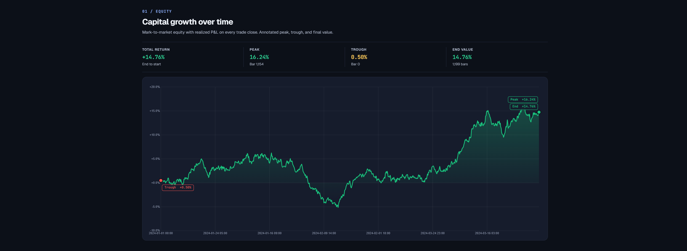
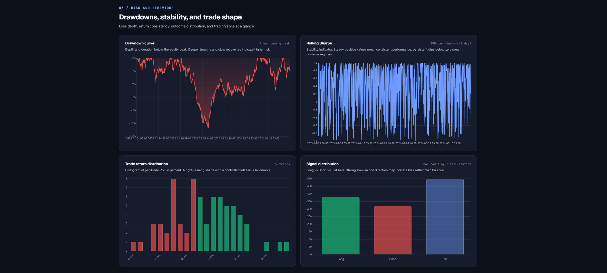
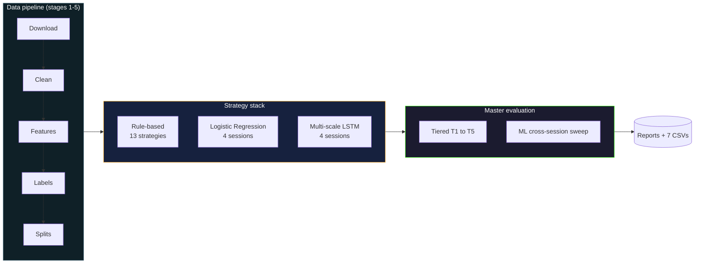
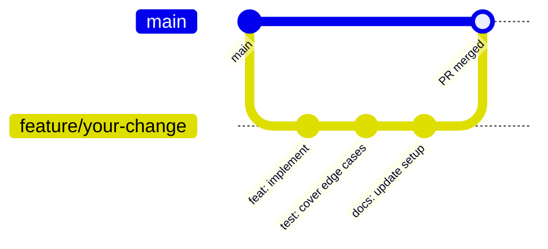

<p align="center">
  
  
  
  
  
  
  
</p>

A reproducible research platform for minute-level FX strategy evaluation across seven currency pairs, three model classes, and four session conditions, scored against a single composite metric on a locked 2024 to 2025 test window.

FX backtest results in published research are rarely comparable across studies. Bar resolutions, cost assumptions, validation windows, and evaluation metrics drift from paper to paper, which makes head-to-head ranking of strategies unreliable. This project is the apparatus that fixes the comparability problem: every strategy, whether a hand-coded rule, a calibrated linear model, or a multi-scale recurrent network, runs against identical bars, identical costs, identical splits, and is scored by an identical 0-to-100 composite metric. The deliverable is the platform plus the answers to three research questions about reproducibility, session conditioning, and model complexity.

<p align="center">
  <a href="#quick-start">Quick start</a> ·
  <a href="#architecture">Architecture</a> ·
  <a href="docs/SETUP.md">Setup</a> ·
  <a href="docs/EXPERIMENTS.md">Experiments</a> ·
  <a href="docs/FINDINGS.md">Findings</a> ·
  <a href="ARCHITECTURE.md">Internals</a> ·
  <a href="#contributing">Contributing</a>
</p>

---

## At a glance

<table>
  <tr>
    <td width="50%"><b>Pairs</b></td>
    <td>EURUSD, GBPUSD, USDJPY, USDCHF, USDCAD, AUDUSD, NZDUSD (7 USD majors)</td>
  </tr>
  <tr>
    <td><b>Bar resolution</b></td>
    <td>1 minute, sourced from histdata.com</td>
  </tr>
  <tr>
    <td><b>Date span</b></td>
    <td>2015-01-01 through 2025-12-31</td>
  </tr>
  <tr>
    <td><b>Strategy stack</b></td>
    <td>13 rule-based variants + 4 Logistic Regression conditions + 4 Multi-scale LSTM conditions</td>
  </tr>
  <tr>
    <td><b>Evaluation</b></td>
    <td>5-tier rule-based pipeline (T1 to T5) + ML cross-session sweep (8 strategies x 7 pairs x 4 sessions x 3 spreads)</td>
  </tr>
  <tr>
    <td><b>Scoring</b></td>
    <td>Composite 0 to 100, weighted 35 / 25 / 25 / 15 across net Sharpe, Sortino, Calmar, drawdown safety</td>
  </tr>
  <tr>
    <td><b>Significance test</b></td>
    <td>Diebold-Mariano with Newey-West HAC variance, 4 comparisons per pair</td>
  </tr>
  <tr>
    <td><b>Test framework</b></td>
    <td>pytest, 12 test files covering engine, walk-forward, sessions, and ML adapters</td>
  </tr>
</table>

---

## Demo

The HTML backtest report renders an interactive dashboard with equity curve, drawdown trajectory, rolling Sharpe, signal distribution, and a per-trade ledger. The five screenshots below capture the most informative panels from a recent run.

<table>
  <tr>
    <td align="center" width="50%">
      
      <br/><sub>Report header with the 13 headline metrics and run configuration</sub>
    </td>
    <td align="center" width="50%">
      
      <br/><sub>Equity curve over the test window with drawdown overlay</sub>
    </td>
  </tr>
  <tr>
    <td align="center">
      
      <br/><sub>Rolling Sharpe (390-bar window) tracks regime-by-regime stability</sub>
    </td>
    <td align="center">
      
      <br/><sub>Signal distribution histogram and recent-trade ledger</sub>
    </td>
  </tr>
  <tr>
    <td colspan="2" align="center">
      
      <br/><sub>Multi-strategy head-to-head with overlaid equity curves</sub>
    </td>
  </tr>
</table>

A full sample HTML report covering five pairs and four ML strategies is committed to the repository for reference: [docs/assets/sample_report.html](docs/assets/sample_report.html). Download and open it in any modern browser to interact with the equity curves, drawdown overlay, and trade ledger directly.

---

## Quick start

The fastest path from clone to first result is the bootstrap script, which handles environment creation, dependency install, verification, and (optionally) the data pipeline and model training in one command.

### 1. Clone and bootstrap

```bash
git clone https://github.com/Kanyal-HarsH/forex-algo-trading.git
cd forex-algo-trading
python bootstrap.py
```

The script verifies the Python version, creates `./venv`, upgrades pip, installs every pinned dependency from `requirements.txt`, runs the test suite, and prompts before the long-running pipeline (90 minutes to 3 hours) and model training (8 to 14 hours). Skip those prompts with `--no-pipeline --no-train` if you only want the environment, or accept everything unattended with `--yes`.

```bash
python bootstrap.py --no-pipeline --no-train   # environment only
python bootstrap.py --yes                       # full setup, unattended
```

If you prefer manual control, the equivalent steps are documented in [docs/SETUP.md](docs/SETUP.md).

### 2. Activate the environment

```bash
source venv/bin/activate          # macOS / Linux
venv\Scripts\activate              # Windows
```

### 3. Run a single backtest

```bash
python backtest/run_backtest.py \
  --pair EURUSD \
  --strategy RSI_p14_os30_ob70 \
  --split full \
  --capital 10000 \
  --no-browser
```

Expected console output, abridged:

```
================================================================================
  FXAlgo Backtest Runner
================================================================================
  Pairs        : EURUSD
  Strategies   : RSI_p14_os30_ob70
  Split        : full
  Capital      : $10,000.00
  Spread       : table default
  Session      : all hours
  Direction    : long_short
--------------------------------------------------------------------------------
  Running 1 backtest...
--------------------------------------------------------------------------------
  EURUSD / RSI_p14_os30_ob70
    net_sharpe   : +0.4123
    sortino      : +0.5891
    calmar       : +0.2104
    max_drawdown : -0.0834
    n_trades     : 217
    capital_final: $11,234.56
--------------------------------------------------------------------------------
  Report written: backtest/reports/report_EURUSD_RSI_p14_os30_ob70_<timestamp>.html
```

Open the HTML report in a browser to see the equity curve, the drawdown trajectory, the rolling Sharpe panel, and the full trade ledger.

The full setup walkthrough, the bootstrap procedure for a fresh clone, and every CLI flag with sample output live in [docs/SETUP.md](docs/SETUP.md).

---

## The three research questions

The platform is organised around three questions. Each one has a measurable success criterion baked into the master evaluation.

**RQ0, reproducibility.** Identical seeds, identical splits, and unmodified code must produce identical evaluation outputs on every run. This is a precondition for the other two questions. The pytest suite covers the regressions that erode reproducibility silently (wrong index alignment between features and labels, scaler fit on the wrong split, session masks that include or exclude the boundary minute inconsistently, fold-path resolution that drifts between row-index slicing and on-disk Parquet reads).

**RQ1, session conditioning.** Models trained per trading session (London, New York, Asia) are compared head-to-head against a single global model fit on all sessions. The hypothesis is that intraday FX regimes differ enough across sessions that pooling discards usable signal. The comparison materialises as a 4 by 4 transfer matrix per pair per model class, where the diagonal is in-domain Sharpe and the off-diagonal is the cost of training in one regime and predicting in another.

**RQ2, model complexity.** A multi-scale LSTM with explicit short-horizon and long-horizon branches is compared against a Logistic Regression baseline under identical evaluation conditions. The metric is cost-adjusted Sharpe, not classification AUC. A model that achieves 0.62 AUC and a net Sharpe of -0.4 has not done its job. A 40-line rule-based strategy that achieves 0.51 AUC and a net Sharpe of 0.8 has.

The framing matters. The platform was built so that economic metrics dominate over classification metrics. AUC, accuracy, log-loss, and per-class precision and recall are all recorded for diagnostic purposes; none of them enter the composite score.

---

## Architecture

The system has three layers connected by a fixed data and evaluation flow.



The data pipeline runs in seven stages, each its own script. Stages 1 to 5 turn raw histdata CSVs into per-pair Parquets of around seventy feature columns and a three-class supervised label. Stage 6 trains models. Stage 7 evaluates.

The strategy stack is layered. Layer one contains the 13 named rule-based strategies. Layer two is Logistic Regression on a frozen 18-feature schema, fit per (pair, session) cell. Layer three is a two-branch LSTM that consumes a 15-bar short window and a 60-bar long window, merges them into a 64-dimensional vector, conditions the merged vector on a 4-dimensional session one-hot, and produces a three-class softmax over DOWN, FLAT, and UP.

The master evaluation runs in a single pass. The rule-based path is tiered: T1 screens, T2 sweeps session and direction, T3 sweeps a small TP/SL grid, T4 measures stability across five walk-forward folds, T5 produces the final result on the locked test split. The ML path runs eight strategies across seven pairs, four evaluation sessions, and three spread multipliers. The signal series for each (pair, ML strategy) is generated once and reused across the twelve session-by-spread combinations, which keeps the runtime manageable.

Full architecture details, including six diagrams, the architecture decision records, and the source map, live in [ARCHITECTURE.md](ARCHITECTURE.md).

---

## Strategies and configurations

### Rule-based stack (13 strategies)

| Family | Variants | What it trades |
|--------|----------|----------------|
| MA Crossover | `MACrossover_f20_s50_EMA`, `MACrossover_f50_s200_EMA`, `MACrossover_f20_s50_SMA` | Signed difference between fast and slow moving average |
| Momentum | `Momentum_lb60`, `Momentum_lb120` | Sign of the n-bar return |
| Donchian | `Donchian_p20`, `Donchian_p55` | Breakouts of the rolling n-bar high or low |
| RSI | `RSI_p14_os30_ob70`, `RSI_p14_os20_ob80` | Mean reversion against the n-bar Relative Strength Index |
| Bollinger | `BB_p20_std2_0`, `BB_p60_std2_0` | Reversals at the upper and lower bands |
| MACD | `MACD_f26_s65_sig9`, `MACD_f78_s195_sig13` | Crossovers of the MACD line and its signal line |

### Machine learning stack (8 strategies)

Each ML model class produces four named strategies, one per session condition.

| Strategy | Architecture | Training data |
|----------|--------------|---------------|
| `LR_global` | LogisticRegression(C=0.1, multinomial, balanced, seed=42) on 18 features | All training-split bars |
| `LR_london`, `LR_ny`, `LR_asia` | Same architecture, same scaler as global | Training-split bars filtered to the named session |
| `LSTM_global` | Two-branch LSTM (15-bar short + 60-bar long), session injection at merge, 3-class softmax | All training-split bars |
| `LSTM_london`, `LSTM_ny`, `LSTM_asia` | Same architecture | Training-split bars filtered to the named session |

### Composite scoring

A single 0-to-100 score ranks every strategy in every tier. Two hard gates remove statistically meaningless or economically catastrophic strategies before they can be ranked.

| Component | Weight | Cap | Floor |
|-----------|:------:|:----:|:------:|
| Net Sharpe | 35% | 5.0 | 0 |
| Sortino | 25% | 5.0 | 0 |
| Calmar | 25% | 3.0 | 0 |
| Drawdown safety | 15% | 100 | 0 |

Hard gates: `n_trades < 10` zeros the score. `max_drawdown < -0.95` zeros the score. The grade scale runs A (80+), B (60-79), C (40-59), D (20-39), F (under 20).

### Per-pair flat spreads

| Pair | Spread (pips) | Pair | Spread (pips) |
|------|:-------------:|------|:-------------:|
| EURUSD | 0.6 | USDCHF | 1.0 |
| GBPUSD | 0.8 | USDCAD | 1.0 |
| USDJPY | 0.7 | NZDUSD | 1.4 |
| AUDUSD | 0.8 | | |

The spread enters the cost model multiplied by the pair's pip size (`0.0001` for non-JPY pairs, `0.01` for JPY pairs). Spread is applied identically to every strategy in the system, which makes the comparison harder to abuse.

### Locked temporal splits

| Window | Range | Purpose |
|--------|-------|---------|
| Train | 2015-01-01 to 2021-12-31 | Model fitting; no tuning decisions read from this window during evaluation |
| Validation | 2022-01-01 to 2023-12-31 | All tuning decisions (T1-T3 of the rule-based path) |
| Test | 2024-01-01 to 2025-12-31 | Final evaluation; touched once per cycle |
| Folds | 5 contiguous slices inside the training span | Stability analysis (T4) |

These dates are constants in `config/constants.py`. They are not CLI flags. Changing them invalidates the comparability the platform is built around, so the script reads them at startup and refuses to honour any override that lies outside the test window.

---

## Project structure

```
forex-algo-trading/
│
├── 📂 backtest/                  Backtest engine, strategies, CLI, HTML reports
│   ├── engine.py                 run_backtest, run_wf_folds, BacktestResult (13 metrics)
│   ├── strategies.py             STRATEGY_REGISTRY (13 rule-based families) + ML adapters
│   ├── run_backtest.py           Per-strategy CLI with multi-strategy and multi-pair support
│   ├── report_generator.py       HTML report builder driven by Jinja templates
│   ├── reports/                  Generated HTML reports (gitignored)
│   └── templates/                Jinja templates: report.html
│
├── 📂 scripts/                   Pipeline stages and master evaluation
│   ├── _common.py                Shared helpers used across pipeline stages
│   ├── download_fx_data.py       Stage 1: pull yearly CSVs from histdata.com
│   ├── clean_fx_data.py          Stage 2: validate, normalise, write Parquet
│   ├── features_fx_data.py       Stage 3: compute features (~70 columns per pair)
│   ├── labels_fx_data.py         Stage 4: three-class forward-return labels
│   ├── split_fx_data.py          Stage 5: train/val/test + 5 folds + per-pair scalers
│   ├── train_model.py            Stage 6: train one (pair, model_type, session) cell
│   ├── train_all.py              Train every cell in the LR x LSTM grid
│   ├── master_eval.py            Stage 7: definitive evaluation
│   ├── evaluate_ml.py            Standalone ML evaluation (legacy, kept for reference)
│   ├── fx_master_test_runner.py  Legacy multi-strategy runner (kept for reference)
│   └── export_report_pdf.py      Optional HTML to PDF exporter (requires playwright)
│
├── 📂 config/                    Frozen runtime constants
│   ├── constants.py              Locked split dates, frozen feature lists, env overrides
│   └── logging_setup.py          Root logger configuration
│
├── 📂 tests/                     pytest suite (12 files)
├── 📂 output/master_eval/        Master evaluation outputs (CSVs + master_report.txt)
├── 📂 models/                    Trained model checkpoints
│   ├── global/                   Global-condition checkpoints
│   └── session/                  Session-conditional checkpoints
│       ├── london/
│       ├── ny/
│       └── asia/
├── 📂 scalers/                   Per-pair StandardScaler + feature_cols list
│
├── 📂 data/                      Raw + cleaned price data (gitignored, ~2.6 GB)
├── 📂 features/                  Per-pair features (gitignored, ~6.5 GB)
├── 📂 labels/                    Per-pair labels (gitignored, ~6.9 GB)
├── 📂 datasets/                  Train/val/test/folds (gitignored, ~30 GB)
│
├── 📂 docs/                      Documentation
│   ├── SETUP.md                  Step-by-step install, configuration, and usage
│   ├── EXPERIMENTS.md            Experimentation framework, catalogue, reproducibility
│   ├── FINDINGS.md               Findings and results (filled in after final run)
│   └── assets/                   Demo screenshots and sample HTML report
│
├── 📂 eda/                       Exploratory data analysis outputs
│
├── README.md                     This file
├── ARCHITECTURE.md               Full architecture documentation
├── requirements.txt              Python dependencies
├── .env.example                  Documented runtime overrides
└── .gitignore
```

The four large directories (`data/`, `features/`, `labels/`, `datasets/`) are gitignored. They are regenerable from the seven-stage pipeline; the bootstrap procedure with expected runtimes is in [docs/SETUP.md](docs/SETUP.md). The `models/` and `scalers/` directory trees ship via `.gitkeep` so that fresh clones already have the right shape, while the actual checkpoint files (`*.pkl`, `*.pt`) stay out of git.

---

## End-to-end walkthrough

A new contributor moves through the platform in roughly this order. Each step is documented in detail in [docs/SETUP.md](docs/SETUP.md); this section is the high-level path.

### Step 1: bootstrap the data pipeline

A fresh clone has empty `data/`, `features/`, `labels/`, `datasets/`, and `scalers/` directories (all gitignored). The five-stage pipeline regenerates them in order. Expect 90 minutes to 3 hours total on a recent laptop, dominated by stage 3 (feature computation across 1.5M bars per pair times 7 pairs).

```bash
python scripts/download_fx_data.py     # ~10-20 min, network-bound
python scripts/clean_fx_data.py        # ~5-10 min
python scripts/features_fx_data.py     # ~45-90 min, CPU-bound
python scripts/labels_fx_data.py       # ~5-10 min
python scripts/split_fx_data.py        # ~10-15 min
```

After the bootstrap completes, every subsequent run reads from the on-disk Parquets directly.

### Step 2: train missing model cells

The repository ships with `models/` directory shape but no checkpoints. The first run of `train_all.py` populates every cell of the seven-pairs by four-sessions grid for both LR and LSTM.

```bash
python scripts/train_all.py
```

Expected per-cell runtime: under 5 minutes for an LR cell, 40 to 90 minutes for an LSTM cell. To train a single cell in isolation:

```bash
python scripts/train_model.py --pair EURUSD --model-type lstm --session global
```

### Step 3: run the master evaluation

The master evaluation runs in a single pass and writes a definitive set of outputs. Start with a single-year run for the fastest meaningful result.

```bash
python scripts/master_eval.py --eval-year 2024 --spreads 1.0
```

Expected runtime: 35 to 50 minutes. Output structure:

```
output/master_eval/
├── master_report.txt              definitive text report
├── results_all.csv                all backtest rows, sorted by composite_score
├── results_rule_based.csv         T1-T5 rows, 13 metrics each
├── results_ml.csv                 ML cross-session rows
├── best_worst_per_pair.csv        per-pair extremes summary
├── transfer_matrix_lr_EURUSD.csv  4 by 4 Sharpe matrices, one per pair
├── transfer_matrix_lstm_EURUSD.csv
├── session_generalisability.csv   in-domain vs transfer pattern
├── dm_test_results.csv            4 Diebold-Mariano comparisons per pair
└── cost_breakeven.csv             cost-breakeven analysis
```

### Step 4: read the results

Open `output/master_eval/master_report.txt` for the headline ranking, the DM test results, and the per-pair transfer matrices in plain text. The seven CSVs are the canonical structured form for downstream analysis. For any (pair, strategy) cell that warrants closer inspection, run `backtest/run_backtest.py` directly to produce an interactive HTML report.

```bash
python backtest/run_backtest.py \
  --pair EURUSD \
  --strategy RSI_p14_os30_ob70 LR_global LSTM_global \
  --split test --from 2024-01-01 --to 2024-12-31 \
  --capital 10000 --no-browser
```

This invocation produces a multi-strategy HTML report comparing three strategies on the same window. The report writes to `backtest/reports/` with an auto-generated timestamped filename.

---

## Reproducibility

Reproducibility is RQ0 of the project, not an afterthought. Several design choices honour the constraint at the cost of speed or convenience.

- **Locked splits.** Train, validation, and test windows are constants in `config/constants.py`, not CLI flags. The master evaluation script validates that any custom date window lies inside the locked test span and refuses anything else.
- **Frozen feature lists.** `LR_FEATURES` (18 items), `LSTM_SHORT_FEATURES` (5 items), and `LSTM_LONG_FEATURES` (4 items, optionally extended) are constants with explicit `do not modify` comments.
- **Scaler contract.** Each `scalers/{PAIR}_scaler.pkl` is a dict with two keys: `scaler` (a fitted `StandardScaler`) and `feature_cols` (the column-order list). Every consumer reads both. A regression test asserts the contract.
- **Deterministic master_eval.** Running with the same `--pairs`, `--eval-year`, `--spreads`, and on-disk model checkpoints produces diff-equal output CSVs across runs.
- **Per-stage regression tests.** The pytest suite covers index alignment, scaler fit on the wrong split, session-mask boundary handling, and fold-path resolution.

The full reproducibility checklist is in [docs/EXPERIMENTS.md](docs/EXPERIMENTS.md).

---

## Contributing

This is a four-person research effort. New contributions are welcome, particularly around test coverage, documentation polish, and reproducibility tooling.

### Development setup

```bash
pip install -r requirements.txt
python -m pytest tests/ -q
```

A linter is not configured by default. Ruff is recommended for ad-hoc linting:

```bash
pip install ruff
ruff check .
```

### Contribution workflow



The recent commit history follows conventional-commit style (`fix:`, `feat:`, `docs:`, `chore:`, `test:`, `refactor:`). New contributions should match.

### Conventional commits

| Type | When to use | Version bump |
|------|-------------|--------------|
| `feat` | New user-facing capability | Minor |
| `fix` | Bug fix without intentional behaviour change | Patch |
| `feat!` or `BREAKING CHANGE` footer | Breaking interface change | Major |
| `docs` | Documentation-only change | None |
| `test` | Test-only change | None |
| `refactor` | Internal restructuring without behaviour change | None |
| `chore` | Build, deps, or housekeeping | None |

---

## Team

The platform is built and maintained by four researchers.

| Member | Role |
|--------|------|
| Harsh Singh Kanyal | Engine, master evaluation, infrastructure |
| Haruka Iwami | Feature engineering, labels, statistical testing |
| Istiak Ahmed | Strategy implementations, walk-forward analysis |
| Savindi Hansila Weerakoon | Model training, session conditioning, transfer analysis |

---


<div align="center">
  Built by Harsh Singh Kanyal, Haruka Iwami, Istiak Ahmed, and Savindi Hansila Weerakoon · License: TBD · <a href="https://github.com/Kanyal-HarsH/forex-algo-trading">GitHub</a>
</div>
