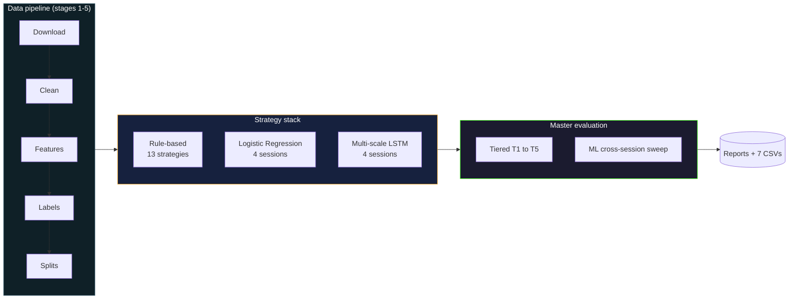
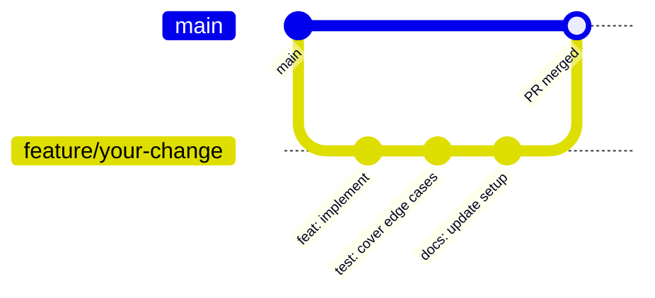

<p align="center">
  
  
  
  
  
  
  
</p>

Pick two FX backtest results out of the literature. The Sharpe ratios won't compare. Different bar resolutions, different spread assumptions, different validation windows, different ideas of what counts as a transaction cost. Strategy claims pile up that nobody can rank against each other.

This platform fixes that. Seven USD majors, one-minute bars from 2015 to 2025, the same costs and the same splits for every strategy in the system, scored on the same 0 to 100 composite. Rule-based, calibrated linear, multi-scale recurrent: same yardstick. The deliverable is the platform plus answers to three research questions: RQ0 reproducibility, RQ1 session conditioning, RQ2 LSTM versus Logistic Regression on the locked 2024 to 2025 test window.

## Documentation index

Pick the entry point that matches the goal. Read times are rough; reference docs are not meant to be read end-to-end.

| Document | What it covers | When to open it |
|----------|----------------|-----------------|
| [docs/REPLICATION.md](docs/REPLICATION.md) | Step-by-step from `git clone` to a working backtest and a complete master evaluation. Every command, every flag, every expected output. | First time. Read this end-to-end. |
| [docs/SETUP.md](docs/SETUP.md) | Long-form install reference. Every CLI flag for every script. Bootstrap procedure. Advanced usage collapsibles. | When a flag in REPLICATION.md is unfamiliar. |
| [ARCHITECTURE.md](ARCHITECTURE.md) | Six Mermaid diagrams (system, sequence, classes, data flow, evaluation tiers, dependencies). Architecture decision records. Source map. Implementation notes. | Before refactoring or proposing a design change. |
| [docs/EXPERIMENTS.md](docs/EXPERIMENTS.md) | Three research questions, experiment catalogue, reproducibility checklist, Diebold-Mariano test design, walk-forward stability formula. | Before running the master evaluation. |
| [docs/FINDINGS.md](docs/FINDINGS.md) | Results scaffolding. Filled in by hand from `output/master_eval/master_report.txt` after the final run. | After the final master-eval run completes. |

The five docs above are the canonical surface. The README from here on is a snapshot: motivation, demo screenshots, strategy menu, project layout, contributing notes.

## Quick start

The fastest path: bootstrap script first, single command. Run from the project root:

```bash
python bootstrap.py --no-pipeline --no-train
```

The flags used above:

- `--no-pipeline`: skip the multi-hour data download and feature build (run later when needed)
- `--no-train`: skip the multi-hour LR + LSTM training grid

That single command verifies Python 3.11+, creates `./venv`, upgrades pip, installs every pinned dependency from `requirements.txt`, and runs the pytest suite. Drop `--no-pipeline --no-train` to run everything; pass `--yes` to accept all prompts unattended.

Once the script finishes, activate the environment in the shell:

```bash
source venv/bin/activate
```

On Windows: `venv\Scripts\activate`. The full step-by-step including the manual install path lives in [docs/REPLICATION.md](docs/REPLICATION.md).

A first backtest. Flags:

- `--pair EURUSD`: the currency pair
- `--strategy RSI_p14_os30_ob70`: RSI mean reversion (period 14, oversold 30, overbought 70)
- `--split full`: load the cleaned full-history parquet (rule-based strategies have no fittable parameters, so `full` is always correct for them)
- `--capital 10000`: starting capital in USD
- `--no-browser`: write the report to disk without auto-opening it

```bash
python backtest/run_backtest.py --pair EURUSD --strategy RSI_p14_os30_ob70 --split full --capital 10000 --no-browser
```

Console output ends with `Report written: backtest/reports/report_EURUSD_RSI_p14_os30_ob70_<timestamp>.html`. Open the HTML report in a browser for the equity curve, drawdown trajectory, rolling Sharpe panel, and full trade ledger. A pre-generated sample report is committed at [docs/assets/sample_report.html](docs/assets/sample_report.html).

## At a glance

<table>
  <tr>
    <td width="50%"><b>Pairs</b></td>
    <td>EURUSD, GBPUSD, USDJPY, USDCHF, USDCAD, AUDUSD, NZDUSD (7 USD majors)</td>
  </tr>
  <tr>
    <td><b>Bar resolution</b></td>
    <td>1 minute, sourced from histdata.com</td>
  </tr>
  <tr>
    <td><b>Date span</b></td>
    <td>2015-01-01 through 2025-12-31</td>
  </tr>
  <tr>
    <td><b>Strategy stack</b></td>
    <td>13 rule-based variants + 4 Logistic Regression conditions + 4 Multi-scale LSTM conditions</td>
  </tr>
  <tr>
    <td><b>Evaluation</b></td>
    <td>5-tier rule-based pipeline (T1 to T5) + ML cross-session sweep (8 strategies x 7 pairs x 4 sessions x 3 spreads)</td>
  </tr>
  <tr>
    <td><b>Scoring</b></td>
    <td>Composite 0 to 100, weighted 35 / 25 / 25 / 15 across net Sharpe, Sortino, Calmar, drawdown safety</td>
  </tr>
  <tr>
    <td><b>Significance test</b></td>
    <td>Diebold-Mariano with Newey-West HAC variance, 4 comparisons per pair</td>
  </tr>
  <tr>
    <td><b>Test framework</b></td>
    <td>pytest, 12 test files covering engine, walk-forward, sessions, and ML adapters</td>
  </tr>
</table>

## Demo

The HTML backtest report renders an interactive dashboard: equity curve, drawdown trajectory, rolling Sharpe, signal distribution, and per-trade ledger. The five screenshots below capture the most informative panels from a recent run. The full interactive report is at [docs/assets/sample_report.html](docs/assets/sample_report.html); download and open in any modern browser.

<table>
  <tr>
    <td align="center" width="50%">
      
      <br/><sub>Report header. The thirteen headline metrics and run configuration.</sub>
    </td>
    <td align="center" width="50%">
      
      <br/><sub>Equity curve over the test window with drawdown overlaid.</sub>
    </td>
  </tr>
  <tr>
    <td align="center">
      
      <br/><sub>Rolling Sharpe (390-bar window). Tracks regime-by-regime stability.</sub>
    </td>
    <td align="center">
      
      <br/><sub>Signal distribution histogram and a recent-trade ledger.</sub>
    </td>
  </tr>
  <tr>
    <td colspan="2" align="center">
      
      <br/><sub>Multi-strategy head-to-head. Three equity curves on shared axes.</sub>
    </td>
  </tr>
</table>

## What the three research questions are

The platform is built around three questions. They are not equally weighted; the first one is the precondition for the other two.

**RQ0 is reproducibility.** Run the master evaluation twice with the same seeds, the same splits, and the same model checkpoints. The two `results_all.csv` files have to be byte-identical. If they are not, the platform has failed RQ0 and the rest of the answers don't survive scrutiny. The pytest suite covers the regressions that erode reproducibility quietly: wrong index alignment between features and labels, scaler fit on the wrong split, session masks that include or exclude the boundary minute inconsistently, fold-path resolution drifting between row-index slicing and on-disk Parquet reads.

**RQ1 is session conditioning.** Train one model per session. Train a global model on everything. Compare cost-adjusted Sharpe. The hypothesis is that intraday FX regimes differ enough across Asia, London, and New York that pooling discards usable signal. The result materialises as a 4 by 4 transfer matrix per pair per model class. Diagonal cells are in-domain (trained on London, evaluated on London). Off-diagonal cells are transfer (trained on London, evaluated on NY). The diagonal needs to beat the off-diagonal for session conditioning to be worth the extra training.

**RQ2 is model complexity.** A two-branch multi-scale LSTM versus a calibrated Logistic Regression on the same 18 features, both fit per (pair, session). The metric is cost-adjusted Sharpe, not classification AUC. A model that scores 0.62 AUC and a net Sharpe of -0.4 has not done its job. A 40-line rule-based strategy that scores 0.51 AUC and a net Sharpe of 0.8 has. Economic metrics dominate over classification metrics in the scoring; classification metrics are diagnostic only.

## Architecture

Three layers connected by a fixed data and evaluation flow.



Stages 1 to 5 turn raw histdata CSVs into per-pair Parquets of around 70 feature columns and a three-class label. Stage 6 trains models. Stage 7 evaluates. Each stage is a separate script writing to a fixed location with a fixed schema, so a failure in one stage can be repaired and re-run without invalidating the rest.

The strategy stack is layered. Layer one is the 13 rule-based families. Layer two is Logistic Regression on a frozen 18-feature schema, fit per (pair, session). Layer three is a two-branch LSTM. The short branch sees a 15-bar window of returns and short-horizon volatility. The long branch sees a 60-bar window of multi-scale realised volatility. The branches merge into a 64-d vector, the 4-d session one-hot is concatenated, and a small MLP head produces a three-class softmax over DOWN, FLAT, UP.

The master evaluation is tiered for a reason. T1 screens, T2 sweeps session and direction, T3 sweeps a small TP/SL grid, T4 measures stability across five walk-forward folds, T5 produces the final result on the locked test split. T1 through T3 only ever touch validation data. T4 only ever touches training folds. T5 is the only tier that touches the test split, exactly once per evaluation cycle.

The full version lives in [ARCHITECTURE.md](ARCHITECTURE.md) with all six diagrams, the architecture decision records, the source map, and a section on implementation pitfalls (label remap, batched LSTM inference, scaler contract, fold parquet paths).

## Strategy menu

### Rule-based stack (13 strategies)

| Family | Variants | What it trades |
|--------|----------|----------------|
| MA Crossover | `MACrossover_f20_s50_EMA`, `MACrossover_f50_s200_EMA`, `MACrossover_f20_s50_SMA` | Signed difference between fast and slow moving average |
| Momentum | `Momentum_lb60`, `Momentum_lb120` | Sign of the n-bar return |
| Donchian | `Donchian_p20`, `Donchian_p55` | Breakouts of the rolling n-bar high or low |
| RSI | `RSI_p14_os30_ob70`, `RSI_p14_os20_ob80` | Mean reversion against the n-bar Relative Strength Index |
| Bollinger | `BB_p20_std2_0`, `BB_p60_std2_0` | Reversals at the upper and lower bands |
| MACD | `MACD_f26_s65_sig9`, `MACD_f78_s195_sig13` | Crossovers of the MACD line and its signal line |

### Machine learning stack (8 strategies)

Each ML model class produces four named strategies, one per session condition.

| Strategy | Architecture | Training data |
|----------|--------------|---------------|
| `LR_global` | LogisticRegression(C=0.1, multinomial, balanced, seed=42) on 18 features | All training-split bars |
| `LR_london`, `LR_ny`, `LR_asia` | Same architecture, same scaler as global | Training-split bars filtered to the named session |
| `LSTM_global` | Two-branch LSTM (15-bar short + 60-bar long), session injection at merge, 3-class softmax | All training-split bars |
| `LSTM_london`, `LSTM_ny`, `LSTM_asia` | Same architecture | Training-split bars filtered to the named session |

### Composite scoring

A single 0 to 100 score ranks every strategy in every tier. Two hard gates remove statistically meaningless or economically catastrophic strategies before scoring.

| Component | Weight | Cap | Floor |
|-----------|:------:|:----:|:------:|
| Net Sharpe | 35% | 5.0 | 0 |
| Sortino | 25% | 5.0 | 0 |
| Calmar | 25% | 3.0 | 0 |
| Drawdown safety | 15% | 100 | 0 |

Hard gates: `n_trades < 10` zeros the score. `max_drawdown < -0.95` zeros the score. Grades: A (80+), B (60-79), C (40-59), D (20-39), F (under 20).

### Per-pair flat spreads

| Pair | Spread (pips) | Pair | Spread (pips) |
|------|:-------------:|------|:-------------:|
| EURUSD | 0.6 | USDCHF | 1.0 |
| GBPUSD | 0.8 | USDCAD | 1.0 |
| USDJPY | 0.7 | NZDUSD | 1.4 |
| AUDUSD | 0.8 | | |

The spread enters the cost model multiplied by the pair's pip size (`0.0001` for non-JPY pairs, `0.01` for JPY pairs). Identical for every strategy. Harder to game.

### Locked temporal splits

| Window | Range | Purpose |
|--------|-------|---------|
| Train | 2015-01-01 to 2021-12-31 | Model fitting; no tuning decisions read from this window |
| Validation | 2022-01-01 to 2023-12-31 | All tuning decisions (T1 to T3 of the rule-based path) |
| Test | 2024-01-01 to 2025-12-31 | Final evaluation; touched once per cycle |
| Folds | 5 contiguous slices inside the training span | Stability analysis (T4) |

These dates are constants in `config/constants.py`. Not CLI flags. Changing them invalidates the comparability the platform is built around, so the master evaluation script reads them at startup and refuses any override that lies outside the test window.

## Project structure

```
forex-algo-trading/
│
├── 📂 backtest/                  Backtest engine, strategies, CLI, HTML reports
│   ├── engine.py                 run_backtest, run_wf_folds, BacktestResult
│   ├── strategies.py             STRATEGY_REGISTRY (13 rule-based) + ML adapters
│   ├── run_backtest.py           Per-strategy CLI with multi-strategy support
│   ├── report_generator.py       HTML report builder driven by Jinja templates
│   ├── reports/                  Generated HTML reports (gitignored)
│   └── templates/                Jinja templates: report.html
│
├── 📂 scripts/                   Pipeline stages and master evaluation
│   ├── _common.py                Shared helpers used across pipeline stages
│   ├── download_fx_data.py       Stage 1: pull yearly CSVs from histdata.com
│   ├── clean_fx_data.py          Stage 2: validate, normalise, write Parquet
│   ├── features_fx_data.py       Stage 3: compute features (~70 columns per pair)
│   ├── labels_fx_data.py         Stage 4: three-class forward-return labels
│   ├── split_fx_data.py          Stage 5: train/val/test + 5 folds + per-pair scalers
│   ├── train_model.py            Stage 6: train one (pair, model_type, session) cell
│   ├── train_all.py              Train every cell in the LR x LSTM grid
│   ├── master_eval.py            Stage 7: definitive evaluation
│   ├── evaluate_ml.py            Standalone ML evaluation (legacy, kept for reference)
│   ├── fx_master_test_runner.py  Legacy multi-strategy runner (kept for reference)
│   └── export_report_pdf.py      Optional HTML to PDF exporter (requires playwright)
│
├── 📂 config/                    Frozen runtime constants
│   ├── constants.py              Locked split dates, frozen feature lists, env overrides
│   └── logging_setup.py          Root logger configuration
│
├── 📂 tests/                     pytest suite (12 files)
├── 📂 output/master_eval/        Master evaluation outputs (CSVs + master_report.txt)
├── 📂 models/                    Trained model checkpoints (global + session)
├── 📂 scalers/                   Per-pair StandardScaler + feature_cols list
│
├── 📂 data/                      Raw + cleaned price data (gitignored, ~2.6 GB)
├── 📂 features/                  Per-pair features (gitignored, ~6.5 GB)
├── 📂 labels/                    Per-pair labels (gitignored, ~6.9 GB)
├── 📂 datasets/                  Train/val/test/folds (gitignored, ~30 GB)
│
├── 📂 docs/                      Documentation
│   ├── REPLICATION.md            Step-by-step walkthrough
│   ├── SETUP.md                  Long-form CLI reference
│   ├── EXPERIMENTS.md            Experimental framework and reproducibility
│   ├── FINDINGS.md               Results scaffolding
│   └── assets/                   Demo screenshots and sample HTML report
│
├── 📂 eda/                       Exploratory data analysis outputs
│
├── README.md                     This file
├── ARCHITECTURE.md               Full architecture documentation
├── bootstrap.py                  One-step setup script
├── requirements.txt              Pinned dependencies
├── .env.example                  Documented runtime overrides
└── .gitignore
```

The four large directories (`data/`, `features/`, `labels/`, `datasets/`) are gitignored. Regenerate them from the seven-stage pipeline; the bootstrap procedure with expected runtimes is in [docs/REPLICATION.md](docs/REPLICATION.md). The `models/` and `scalers/` directory shape ships via `.gitkeep` so a fresh clone has the right tree, while the actual checkpoint files (`*.pkl`, `*.pt`) stay out of git.

## Reproducibility

Reproducibility is RQ0, not an afterthought. Several design choices honour it at the cost of speed or convenience.

- **Locked splits.** Train, validation, and test windows are constants in `config/constants.py`, not CLI flags. The master evaluation validates that any custom date window lies inside the locked test span and refuses anything else.
- **Frozen feature lists.** `LR_FEATURES` (18 items), `LSTM_SHORT_FEATURES` (5 items), and `LSTM_LONG_FEATURES` (4 items, optionally extended) are constants with explicit `do not modify` comments.
- **Scaler contract.** Each `scalers/{PAIR}_scaler.pkl` is a dict with two keys: `scaler` (a fitted `StandardScaler`) and `feature_cols` (the column-order list). Every consumer reads both. A regression test asserts the contract.
- **Deterministic master_eval.** Same `--pairs`, same `--eval-year`, same `--spreads`, same on-disk model checkpoints, the output CSVs are diff-equal across runs.
- **Per-stage regression tests.** The pytest suite covers index alignment, scaler fit on the wrong split, session-mask boundary handling, and fold-path resolution.

The full reproducibility checklist is in [docs/EXPERIMENTS.md](docs/EXPERIMENTS.md).

## Contributing

Four-person research team. New contributions are welcome, particularly around test coverage, documentation polish, and reproducibility tooling.

### Development setup

```bash
pip install -r requirements.txt
python -m pytest tests/ -q
```

A linter is not configured by default. Ruff is recommended for ad-hoc linting:

```bash
pip install ruff
ruff check .
```

### Contribution workflow



The recent commit history follows conventional-commit style (`fix:`, `feat:`, `docs:`, `chore:`, `test:`, `refactor:`). New contributions should match.

### Conventional commits

| Type | When to use | Version bump |
|------|-------------|--------------|
| `feat` | New user-facing capability | Minor |
| `fix` | Bug fix without intentional behaviour change | Patch |
| `feat!` or `BREAKING CHANGE` footer | Breaking interface change | Major |
| `docs` | Documentation-only change | None |
| `test` | Test-only change | None |
| `refactor` | Internal restructuring without behaviour change | None |
| `chore` | Build, deps, or housekeeping | None |

<details>
<summary>Code of conduct</summary>

A formal Code of Conduct has not yet been adopted. In the interim, contributors are expected to be respectful, constructive, and focused on the technical merits of the work. The project follows the spirit of the Contributor Covenant.

</details>

<details>
<summary>Security policy</summary>

Security disclosures should be reported privately to the repository maintainer rather than via public issues. A formal `SECURITY.md` is on the project task list.

</details>

<details>
<summary>Roadmap</summary>

Immediate next steps:

1. Train the remaining LSTM cells. The full grid is 7 pairs x 4 sessions x 2 model types = 56 checkpoints.
2. Run a full master evaluation across all seven pairs and the full 2024 to 2025 test window.
3. Read the resulting reports and write up the answers to RQ0, RQ1, and RQ2 in [docs/FINDINGS.md](docs/FINDINGS.md).

Open project tasks that are out of scope for the current research run:

- Pin `requirements.txt` to specific dependency versions (done in the most recent setup pass).
- Add a LICENSE file.
- Adopt a code-style configuration (ruff or black).
- Add a `SECURITY.md` and a formal Code of Conduct.

</details>

## Team

The platform is built and maintained by four researchers.

| Member | Role |
|--------|------|
| Harsh Singh Kanyal | Engine, master evaluation, infrastructure |
| Haruka Iwami | Feature engineering, labels, statistical testing |
| Istiak Ahmed | Strategy implementations, walk-forward analysis |
| Savindi Hansila Weerakoon | Model training, session conditioning, transfer analysis |


<div align="center">
  Built by Harsh Singh Kanyal, Haruka Iwami, Istiak Ahmed, and Savindi Hansila Weerakoon · License: TBD · <a href="https://github.com/Kanyal-HarsH/forex-algo-trading">GitHub</a>
</div>
